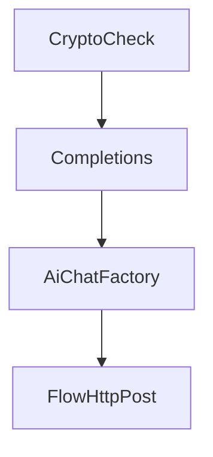
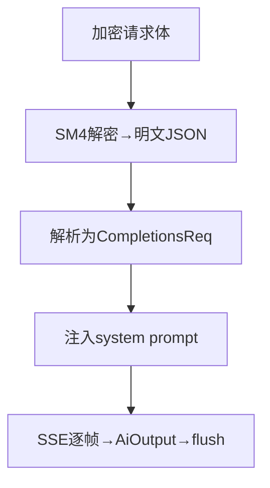

# Code Map — 任务型代码导航地图

生成并维护 `CODEMAP.md`：让下一次冷启动的会话能**在两步内**从「我要干 X」走到「第一个该看的锚点」。

它**补充** CLAUDE.md，不替代它。CLAUDE.md 管命令、约定、项目概览；CODEMAP.md 管「做 X 要改哪几个文件」「数据怎么流过系统」「这些坑已经有人踩过」。

> 完整的证据标签与新鲜度规则见 [证据与新鲜度规范](references/evidence-model.md)。

---

## 首要原则：按需加载，不强制前置读取

CODEMAP **不是一个必须通读的文档**，而是一个**卡住时可以拉取的缓存**。

因此：

1. **不做强制前置读。** 上面 description 里的摩擦信号命中任意一条，才去读对应领域包。没卡住就别读 —— 地图是省时间的工具，不是仪式。
2. **按需加载要求地图「局部可读」。** 领域包必须能脱离 L1 独立读懂；L1 必须薄到「读 20 行就知道该不该继续往下钻」。
3. **没读到不等于没记。** 因为没加载地图而走了弯路，是**检索失败**，不是地图的错。事后按最小粒度回填一条（症状定位或假朋友），让下次这条路变短。
4. **读到的内容先看 `status`。** `stale` / `needs-review` / `conflict` 只能当线索，不得作为实现事实。

## 其余设计原则

5. **任务优先导航**：按「做 X 要改哪些文件」组织，而不是按目录树组织。
6. **锚点只用 `文件路径 -> 符号名`，绝不存储行号**。行号一移动就**静默失效**；符号名稳定可 grep。需要行号时用 `scripts/where.sh <文件> <符号>` 现算。
7. **核心模块每块不超过 3 行**：职责、关键文件、入口函数。
8. **只记录源码推不出来、或推出来代价很大的内容**。目录树、完整接口清单、机械的 Controller→Service 罗列，交给你自己的 grep 就行。
9. **地图是干活的副产品，本身不构成任务。** 不能因为「地图还没更新」就停下手上的活，也不能把「我更新了地图」当成交付物。

---

## 产物结构

```text
.claude/CODEMAP.md                    # L1：模块表 + 任务索引 + 症状定位 + 依赖图。上限 120 行
.claude/CODEMAP-<模块>.md             # L2：该模块的调用链 + 假朋友 + 该模块自己的变更记录
.claude/CODEMAP-changelog.md          # 单层模式下的独立变更记录
```

全部**扁平同级**于 `.claude/`，不接受嵌套目录。`<模块>` 用小写英文、数字、连字符，如 `CODEMAP-billing.md`。

---

## 流程

### Step 0：先看 CLAUDE.md

若 `CLAUDE.md` 或 `.claude/CLAUDE.md` 存在，先读。记下它已覆盖的部分（项目概览、命令、约定、技术栈）。
生成 CODEMAP 时**不要重复这些内容**，空间全部留给导航和数据流。
若不存在，照常生成，并在 Step 7 建议创建。

### Step 1：发现

找入口点、顶层结构、主语言/框架。跳过生成代码（`.gen.go`、迁移文件、ORM 产物）。

### Step 2：确定分层模式

跑 `scripts/count_sources.sh [项目根]` 拿确定性的文件数，而不是目测：

- **≤ 50 个文件** → 单层模式，全部写进 `.claude/CODEMAP.md`
- **> 50 个文件** → 两层模式，L1 放模块表 + 任务索引 + 依赖图，每个核心业务模块单独一个 `CODEMAP-<模块>.md`

项目专属的生成路径用 `CODEMAP_EXCLUDE='正则'` 追加排除。

### Step 3：识别核心业务模块

不要列出每个目录。识别**业务模块** —— 一组为某个领域目的服务的文件。每个模块写：职责一行、关键文件 2–4 个（各配入口函数名）、关键函数 2–3 个。

### Step 4：建任务索引

对每个「开发者可能想做的事」，列出要改的文件（路径 + **符号名**）+ 前置条件 + 陷阱。

```markdown
### 新增一个 AI 供应商
1. `internal/service/aichatService/default.go` → `AiChatFactory()` —— 加 case，实现 `ChatStreamModel` 接口
2. `lib/utils/httputil/httputil.go` → `FlowHttpPost()` —— 加 switch 分支，写 `*HandleStreamResponse()`

**前置条件**：确认上游 API 兼容 OpenAI 协议；不兼容则需要自定义请求/响应结构体。
**陷阱**：`FlowHttpPost` 没有 default 兜底 —— 新分支必须显式列出，否则会落到 `BailianHandleStreamResponse`。
```

建索引的方法是**顺着代码追**：工厂/注册表在哪？handler 在哪？类型定义在哪？
对每个任务都问：**要让它跑通，必须先成立什么？有什么边界曾经坑过人？**

### Step 5：症状定位（反向导航）

任务索引是**正向**的（我要做功能 X）。排障是**反向**的（这个现象从哪查）—— 现有结构套不进去，单独成段。

把**可观测的现象**映射到首个锚点：

```markdown
## 症状定位

| 现象 | 首个锚点 | 常见误判 |
| --- | --- | --- |
| 接口返回 401 但 token 没过期 | `identity/service.go -> AuthenticateSession` | 误以为是 aiproxy 侧吊销，实际是本地会话版本号 |
| SSE 中途断流且无错误码 | `httputil.go -> FlowHttpPost` | 误以为上游超时，实际是 flush 缺失 |
```

输入端是**故障现象**，这是排障时最省时间的地方。

### Step 6：假朋友清单（负向导航）

记录「**看着像但别去**」的地方。这类知识源码推不出来（推出来要读完全部才能确认），而且下次一定还会再踩。

```markdown
## 假朋友

- `lib/utils/legacy_ai.go -> ChatV1()` —— 名字像主链路，实际已废弃，仅历史灰度在用。真正的主链路是 `aichatService/default.go`。
- `internal/service/user/` 下有个 `SyncProfile()`，只服务于一次性迁移脚本，不要在此扩展。
```

**硬约束：必须限量、必须真踩过。** 这里只收「确认走过弯路」的条目，否则会退化成抱怨垃圾桶。

### Step 7：追调用链

分两类，别混：

**控制流**（谁调谁 —— 显式函数调用）：



**数据流**（数据怎么变 —— 每一步的形态转换）：



**追踪规则（重要，这是最容易产生幻觉的地方）：**

- **只追显式调用**：函数 A 调函数 B、switch 分支派发、接口实现。**不要追隐式调用**（ORM 钩子、装饰器、反射、事件总线订阅、中间件自动注册）。
- **找不到显式调用就不要猜**：宁可链条短而准确，也不要长而误导。省略那一段，并写「未追踪」说明。
- **每张图 ≤ 12 个节点**。这是可读性启发式，不是铁律：若一条流是**单一线性管道**或**单一决策树**（分支共享同一入口条件，拆开会失去意义），保持完整并加 `<!-- no-split: 原因 -->` 标记。但超过约 18 个节点就说明流程本身太缠，该简化的是代码。
- **每张图后必须有证据标签**：`<!-- evidence: source-verified -->`，另附盲区说明。

### Step 8：写出文档

写到 `.claude/CODEMAP.md`（不存在则创建 `.claude/`）。**先备份**已有文件到 `.claude/CODEMAP.md.bak`，然后：

- **保留所有 `<!-- manual: keep -->` 块，逐字不动。**
- 只重建自动生成的段落（模块表、调用链、依赖图）。
- 若发现人工写的陷阱/铁律**没被包在保护块里**，**把它包起来**，而不是让重扫冲掉。
- **禁止整文件覆盖**，哪怕地图又大又烂。增量改。

文档结构（单层模式）：

```markdown
# [项目名] — Code Map

<!-- codemap-meta
status: current
verified-at: [日期]
verified-commit: [短 commit]
-->

## 核心业务模块
[表格：模块 | 职责 | 关键文件 | 入口函数，每模块 ≤ 3 行，最多 8 个]

## 任务索引
### [任务 1]
[编号列表：文件路径 + 要动的符号名 —— 不写行号]
**前置条件**：...
**陷阱**：...

## 症状定位
[表格：现象 | 首个锚点 | 常见误判]

## 调用链
### [流程 1]
```mermaid
flowchart TD
    [显式调用，≤ 12 节点]
```
<!-- evidence: source-verified — 仅显式静态调用 -->
<!-- 盲区: [这条链没覆盖什么 —— 无重试机制、上游超时直接 502、此路径无集成测试] -->

## 冲突台账
[表格，见 references/evidence-model.md。无冲突则写「无」]

## 模块依赖
```mermaid
flowchart TD
    [紧凑依赖图，≤ 12 节点]
```
[简述：谁是枢纽、谁是叶子、有无循环依赖]
```

两层模式下，L1 省略调用链，改为链接到各模块文件；每个 `CODEMAP-<模块>.md` 内含该模块的详细图 + **自己的变更记录段 + 自己的假朋友段**。

### Step 9：接进 CLAUDE.md

确保 CLAUDE.md 引用它，这样未来会话能自动得知地图存在。

读项目的 `CLAUDE.md`（根目录或 `.claude/`）。若其中没有指向 `.claude/CODEMAP.md` 的行，就加一句（**只追加，不覆盖**）：

```
**当遇到不熟悉的模块，或在某个概念上反复搜索仍找不到确定入口时，读取 `.claude/CODEMAP.md`** —— 它包含任务型文件索引、症状定位、调用链和模块入口，能显著减少摸索时间。
```

注意措辞是**「卡住时读」而非「动手前必读」** —— 强制前置读会被绕过或变成形式主义，只有在真正缺少上下文时加载才有效。

### Step 10：校验（不再依赖自觉抽查）

**跑脚本，不要靠自己打分。**

```bash
scripts/check_map.sh .claude/CODEMAP.md
scripts/check_map.sh --strict .claude/CODEMAP.md   # CI 用
```

它做四件事，都是机械可判定的：

1. **失效锚点** —— 引用的文件或符号是否还实际存在（用 `where.sh` 做定义式匹配，不是「随便出现过」）
2. **条目级过期** —— 逐条比对 `verified-commit..HEAD`，**只报告受影响的条目**，未受影响的仍标为可用
3. **冲突计数** —— 台账里还有多少条未决策
4. **尺寸体检** —— L1 超 120 行、模块包超 200 行即告警

`--strict` 把「失效锚点 / 过期条目 / 冲突 / 非 `current` 状态 / 未纳入 Git」判为失败，可直接挂 CI。

**首次迁移旧地图允许标 `needs-review`，但不得为了通过检查而伪造已验证状态。**

---

## 变更记录

变更记录**不放**在 L1（L1 每次任务都会被加载，而记录只在重跑技能或审计历史时才看）：

- **单层模式** → `.claude/CODEMAP-changelog.md`
- **两层模式** → 无全局记录；每个业务变更记在**它所属模块**的 `CODEMAP-<模块>.md` 末尾。跨模块变更记在拥有其入口点的那个模块下。

格式与规则：

```
| 日期 | 业务域 | 变更 |
| --- | --- | --- |
| 2026-05-13 | Initial | CODEMAP 创建 —— AI 聊天路由、计费、Agent 系统 |
| 2026-06-01 | 计费 | PostConsume 新增企业成员共享池扣减分支（billing_service.go PostConsume） |
```

- **变更**要写清「什么业务逻辑变了」，并**点名行为变化的核心函数名**。写函数名，**绝不写行号**（历史记录里的行号今天写下、明天就无意义，而函数名永远可 grep）。
- **不要记录分析动作**（「分析了 X」「追踪了 Y」「更新了地图」）—— 那是动作，不是变化。
- 每个记录文件/段落**保留最近 20 条**，超出丢最旧的（折叠进 `Last Updated` 摘要）。
- 里程碑条目用 `<!-- manual -->` 包裹可豁免裁剪。

---

## 控制地图膨胀

地图随项目演进会变大，而它每次会话都会被加载，所以**薄是硬指标**。

**先做增量比对**：动手前读相关记录的**最后一条**，把当前代码库和上次记录对照，**只写差异**。某业务域没变就不写。只有真实 delta 才记，不要重复追同一段代码。

好的 delta 条目（点名函数，不写行号）：
- `AiChatFactory 新增 OpenRouter case，handler 为 httputil.go 的 OpenRouterHandleStreamResponse`
- `billing_service.go PostConsume 新增企业成员共享池扣减分支`

坏的条目：
- `分析了 AiChatFactory 函数`（动作不是变化）
- `CODEMAP 更新了`（空话）

**阈值与裁剪**（`<!-- manual -->` 块豁免一切裁剪规则）：

1. **变更记录** —— 裁到最近 20 条。
2. **调用链** —— 单张图超 15 节点则拆成同步/异步两张，**除非它带 `<!-- no-split: ... -->` 标记**（这时尊重记录的理由，只在底层流程真的变了时才重估）。一个模块超过 3 张图，就把它整体移到独立模块包。
3. **核心业务模块表** —— **永不裁剪**，它是主导航锚点。超过 10 个模块时，把冷门的拆进「扩展模块」子节。
4. **任务索引** —— 保留全部条目；若某条引用的文件已删除，删掉该条。
5. **模块依赖图** —— 保留一张，永不重复。

跑 `scripts/check_size.sh .claude 200` 可快速看哪些文件超标。

---

## 四个最常被丢掉的重点

- **别重复 CLAUDE.md**：概览、命令、约定都跳过，把空间全给导航和数据流。
- **任务索引是最重要的段落**：开发者按任务搜索，索引要精确到「路径 + 符号名」，并带前置条件和陷阱，不能只写「改这几个文件」。
- **锚点永远是「路径 + 符号名」，永不写行号**：写 `aichat/default.go → Completions()`。要行号时用 `where.sh` 现算。
- **给每条链写明盲区**：没有重试、没有测试、上游超时怎么表现 —— 缺口和链条本身一样重要。
