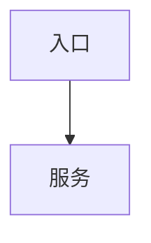
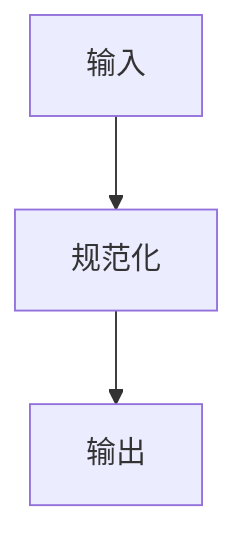
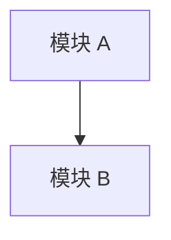

# Mapcode

生成面向 Codex 的代码导航图。`AGENTS.md` 规定项目的工作方式和边界；`.codex/MAPCODE.md` 记录“完成某项任务应改哪些文件”和经源码验证的调用关系。不要重复项目介绍、命令或编码规范。

## 先遵循项目约束

1. 从项目根目录到当前工作目录查找并读取全部适用的 `AGENTS.md`，按目录层级应用其约束。若项目另有 `CLAUDE.md`，只将其作为补充上下文，不把它当作最高优先级。
2. 先确认 `AGENTS.md` 对文档位置、语言、编辑范围、图表格式、提交和测试的要求。发生冲突时，以 `AGENTS.md` 和用户要求为准。
3. 不自动改写、重排或删除 `AGENTS.md` 的既有内容。仅当其中没有冲突且需要让后续任务自动读取导航图时，在根 `AGENTS.md` 末尾追加一行：

   ```markdown
   在进行代码定位、架构理解或修改前，先读取 `.codex/MAPCODE.md`（如存在）。
   ```

4. 输出前再次核对所有路径、符号名称、语言和图表文案是否满足项目约束。

## 建图流程

### 1. 发现范围

- 识别入口、路由、命令、领域服务、存储层、异步任务和测试入口，忽略依赖、构建产物、迁移及生成代码。
- 运行 `scripts/count_sources.sh <项目根目录>` 判断分层方式；如需补充生成目录，设置 `MAPCODE_EXCLUDE='正则'`。
- 阅读已有 `.codex/MAPCODE*.md`、相关日志和受影响模块，而非凭目录名推测业务关系。

### 2. 选择文档布局

- 源码不超过 50 个文件：创建 `.codex/MAPCODE.md`，并把详细调用链放在该文件。
- 超过 50 个文件：创建总览 `.codex/MAPCODE.md`，每个核心领域模块创建 `.codex/MAPCODE-<模块>.md`。总览只保留模块表、任务索引、模块依赖和模块文件链接。
- 运行 `scripts/check_size.sh .codex 200`。超过 200 行的文件应把详细调用链拆到对应模块文件；总览不得因此丢失任务索引。

### 3. 提炼业务模块和任务索引

只列业务模块，不罗列全部目录。每个模块最多三行说明，写明职责、2 至 4 个关键文件和 2 至 3 个入口符号。

任务索引以真实开发动作组织。每个任务按执行顺序列出 `路径 -> 符号`，并补充前置条件和容易遗漏的边界。只保存路径和符号名，绝不保存行号；需要跳转时运行：

```bash
scripts/where.sh <文件> <符号>
```

### 4. 追踪调用和数据

为重要路径分别绘制控制流和数据流：

- 控制流只描述源码中能确认的显式调用、分支分发和接口实现。
- 数据流描述输入、解析、校验、转换、持久化、异步传递和响应等数据形态变化。
- 异步分支使用 Mermaid `subgraph` 或明确标记异步执行。
- 单图通常不超过 12 个节点；超过时按同步/异步或边界拆分。若一条线性管线或单一决策树必须整体阅读，可保留至约 18 节点，并写明 `no-split` 原因。
- 不得把 ORM 钩子、反射、事件订阅、装饰器或自动注册当作已确认调用。找不到显式连接时，注明“未追踪”及验证位置。

每张图后必须写置信度和盲点：

```markdown
<!-- confidence: high - 仅含已验证的显式源码调用 -->
<!-- blind-spots: 未覆盖重试逻辑和中间件执行顺序 -->
```

中低置信度必须给出可执行的验证提示：

```markdown
<!-- confidence: medium - 根据路由命名推断；验证：在 router/ 中搜索 Register -->
```

整图不拆分时增加：

```markdown
<!-- no-split: 单一路由决策树；拆分会丢失分支共享的入口条件 -->
```

### 5. 保护人工知识并增量更新

已有导航图时，先备份为同名 `.bak` 文件。以下块内的内容必须逐字保留，任何自动更新都不得删除或重排：

```markdown
<!-- manual: keep -->
人工记录的前置条件、陷阱和不变量
<!-- /manual -->
```

未包裹但明显属于人工经验的前置条件、陷阱或不变量，应先包入保护块再更新。更新自动区块时只记录相对上次的业务差异；不得把“分析了某函数”当作变更。

- 单层模式的变更日志位于 `.codex/MAPCODE-changelog.md`。
- 双层模式的变更日志位于对应 `.codex/MAPCODE-<模块>.md`。
- 每处最多保留 20 条最新记录，人工保护的里程碑不参与裁剪。
- 每条必须注明业务变化和核心函数/符号，不能写行号。

### 6. 验证后交付

1. 每张 `high` 置信度图至少抽查一条边，确认调用方中确实出现被调符号；未验证的图降为 `medium`。
2. 用 `scripts/where.sh` 确认任务索引中的每个符号仍存在。删除失效条目。
3. 确认每个 `no-split` 的理由仍成立，人工保护块仍原样存在。
4. 在 `最后更新` 中记录生成日期、代码状态、已知缺口和实际抽查项，不要把假设伪装成结论。

## 文档结构

单层 `.codex/MAPCODE.md` 使用以下结构：

```markdown
# <项目名> - 代码导航图

**位置**：`.codex/MAPCODE.md`
**生成日期**：<日期>

## 核心业务模块
| 模块 | 职责 | 关键文件 | 入口符号 |
| --- | --- | --- | --- |

## 任务索引
### <开发任务>
1. `<路径>` -> `<符号>`：<改动目的>

**前置条件**：<条件>
**注意事项**：<边界或风险>

## 调用链
### <流程名> - 控制流

<!-- confidence: high - 仅含已验证的显式源码调用 -->
<!-- blind-spots: <未覆盖范围> -->

### <流程名> - 数据流


## 模块依赖


## 最后更新
- **生成日期**：<日期>
- **代码状态**：<简述>
- **已知缺口**：<未覆盖内容>
- **抽查记录**：<实际验证的边和符号>
```

双层总览省略详细调用链，改为链接到模块图；模块图承载该模块的调用链、人工经验和变更日志。

## 交付要求

- 以任务导航和可靠调用关系为中心，不重复 `AGENTS.md`、项目概览、构建命令或编码规范。
- 使用项目既定语言；没有约定时，说明文字使用简体中文。
- Mermaid 节点应简短、可读，不使用未经确认的关系。
- 结束时报告写入的文件、运行的检查、已验证的范围和仍未确认的范围。
