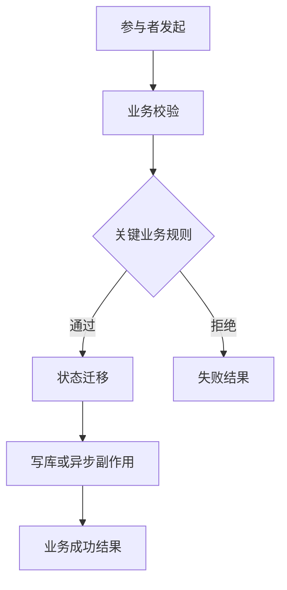
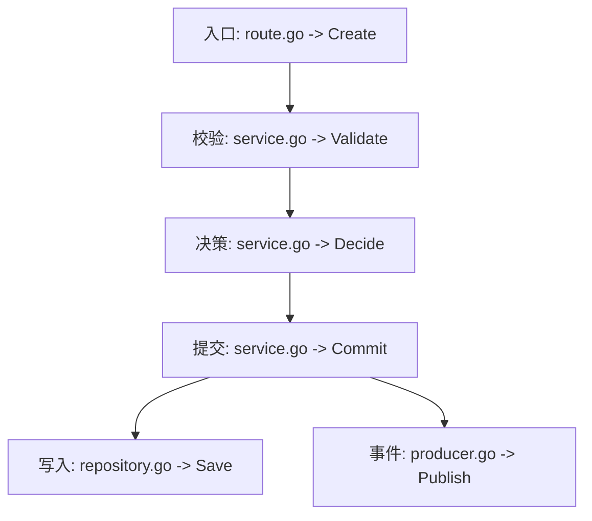
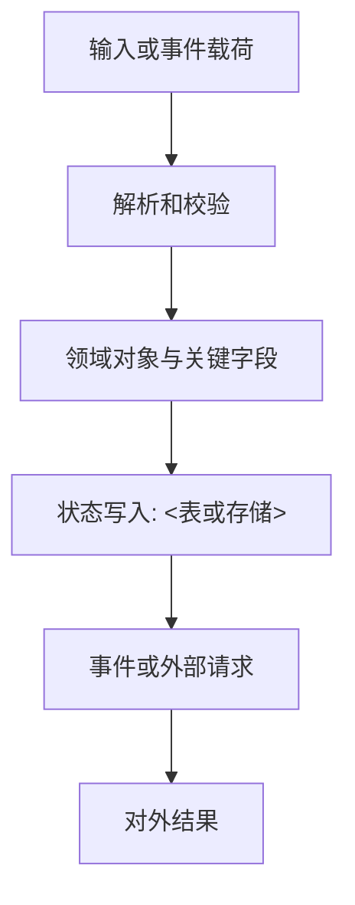

# 业务地图模板

将本模板复制为 `docs/ai/BUSINESS_MAP.md`。复杂领域拆分为 `docs/ai/business/<领域>.md`，总览只链接明细，不重复业务正文。

# <项目名> 业务地图

**唯一事实源**：本文件及其领域明细是跨 AI 共用的业务结论来源。

**最后核对**：<日期>

**已接入 AI**：<入口文件列表>

## 业务域与核心链

| 业务域 | 核心业务链 | 业务成功结果 | 关键状态/实体 | 明细 |
| --- | --- | --- | --- | --- |
| <领域> | <触发到结果> | <价值结果> | `<实体.状态>` | [明细](business/<领域>.md) |

## 任务索引

### <业务改动任务>

**受影响链**：<领域 / 业务链>

**代码落点**：

1. `<路径> -> <符号>`：<业务动作与改动原因>
2. `<路径> -> <符号>`：<后续状态或副作用>

**前置条件**：<必须先满足的规则或数据状态>

**陷阱**：<重复请求、顺序、并发、金额、权限、库存或兼容性风险>

**必须验证**：<状态、关键字段、测试、日志、指标或告警>

## 跨域依赖

## 全局不变量

- <任何业务链都不得破坏的规则>

## 变更摘要

| 日期 | 业务域 | 业务事实变化 | 代码证据 |
| --- | --- | --- | --- |
| <日期> | <领域> | <业务规则或状态变化> | `<路径> -> <符号>` |

## <领域> 业务链

### <业务链名称>

**目标与参与者**：<谁发起，谁受益，业务成功是什么>

**触发与边界**：<API、消息、任务或人工操作；输入和输出>

**状态与真相来源**：<实体、状态迁移、表/缓存/事件、幂等键和事务边界>

### 业务流

### 控制流证据

### 数据与状态流

### 关键规则与不变量

| 规则 | 成立条件 | 违反后果 | 代码或配置证据 |
| --- | --- | --- | --- |
| <规则> | <条件> | <后果> | `<路径> -> <符号>` |

### 副作用、失败与补偿

| 动作 | 顺序/触发时机 | 幂等与重试 | 失败补偿或人工兜底 |
| --- | --- | --- | --- |
| <写库、扣费、发消息等> | <时机> | <键和策略> | <补偿方式> |

### 代码、测试与观测证据

| 业务步骤 | 代码落点 | 测试/观测 | 已验证事实 |
| --- | --- | --- | --- |
| <步骤> | `<路径> -> <符号>` | `<测试/日志/指标>` | <事实> |

<!-- confidence: high - 已核对显式调用、状态写入和对应测试 -->
<!-- evidence: <路径> -> <符号>；<表、事件、测试或日志> -->
<!-- blind-spots: <未确认的外部重试、隐式行为或测试缺口> -->

<!-- manual: keep -->
人工确认的事故结论、业务陷阱或不可违反的不变量
<!-- /manual -->
