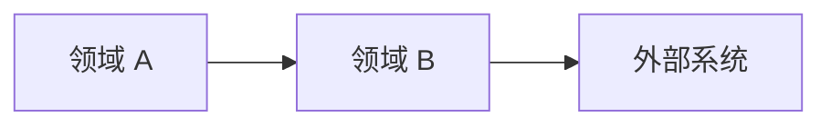
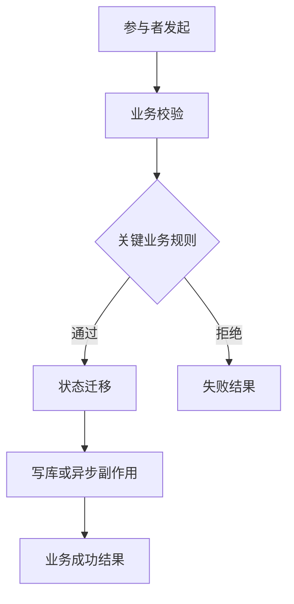
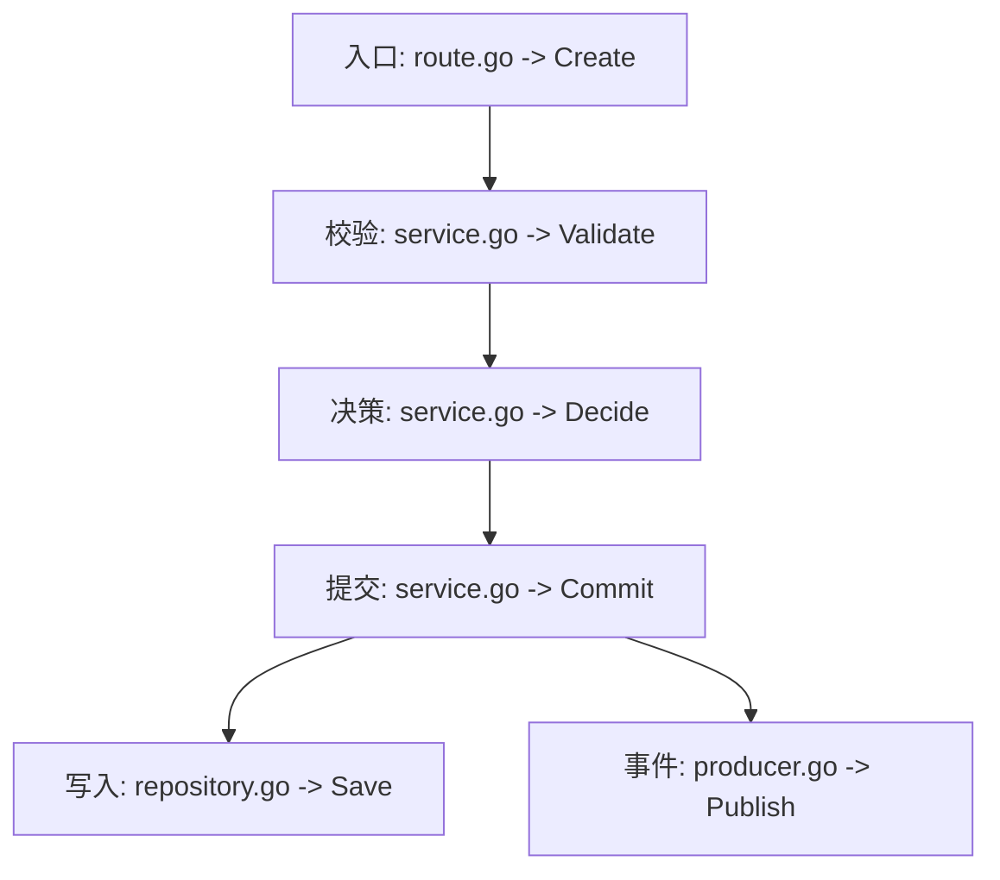
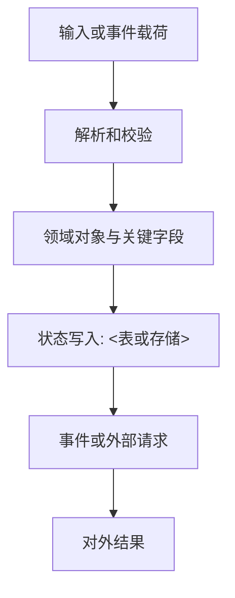

# 业务地图模板

将本模板复制为 `docs/ai/BUSINESS_MAP.md`。该文件是新任务的轻量路由入口，控制在 160 行以内。复杂领域拆分为 `docs/ai/business/<领域>.md`，总览只链接明细，不重复业务正文。

# <项目名> 业务地图

<!-- mapcode-meta
map-role: index
status: needs-review
verified-at: <日期>
verified-commit: <Git commit>
-->

**权威边界**：`human-confirmed` 表示业务要求；源码、测试和运行环境分别决定当前实现、测试覆盖和实际状态。地图是带证据的业务语义索引，不替代这些事实来源。

**已接入 AI**：<入口文件列表>

## 新任务读取规则

1. 先在“任务路由索引”按任务动词、领域词和实体匹配。
2. 读取“最小读取集”列出的领域上下文包；只有跨域或排障时再读取“追加读取集”。
3. 使用代码锚点进入源码，并按“必须验证”完成确认。
4. 找不到路由时，先搜索本文件和领域包标题；完成探索后补充路由。

## 任务路由索引

| 任务/关键词 | 最小读取集 | 追加读取集 | 首个代码锚点 | 关键状态或不变量 | 必须验证 |
| --- | --- | --- | --- | --- | --- |
| <用户会说的任务、别名和实体> | [领域包](business/<领域>.md) | <跨域包或无> | `<路径> -> <符号>` | <状态或规则> | <测试、日志、指标> |

## 业务域与核心链

| 业务域 | 核心业务链 | 业务成功结果 | 关键状态/实体 | 明细 |
| --- | --- | --- | --- | --- |
| <领域> | <触发到结果> | <价值结果> | `<实体.状态>` | [明细](business/<领域>.md) |

## 任务索引

### <业务改动任务>

**受影响链**：<领域 / 业务链>

**代码落点**：

1. `<路径> -> <符号>`：<业务动作与改动原因>
2. `<路径> -> <符号>`：<后续状态或副作用>

**前置条件**：<必须先满足的规则或数据状态>

**陷阱**：<重复请求、顺序、并发、金额、权限、库存或兼容性风险>

**必须验证**：<状态、关键字段、测试、日志、指标或告警>

## 跨域依赖

## 全局不变量

- [RULE][human-confirmed] <任何业务链都不得破坏的规则>

## 已知冲突

| 编号 | 业务规则 | 当前实现 | 风险 | 待决策 |
| --- | --- | --- | --- | --- |
| C-001 | <人工确认要求> | <源码、测试或运行事实> | <违反后果> | <需要谁确认什么> |

## 变更摘要

| 日期 | 业务域 | 业务事实变化 | 代码证据 |
| --- | --- | --- | --- |
| <日期> | <领域> | <业务规则或状态变化> | `<路径> -> <符号>` |

## <领域> 业务链

<!-- mapcode-meta
map-role: domain
status: needs-review
verified-at: <日期>
verified-commit: <Git commit>
-->

**适用任务/关键词**：<任务动词、实体、同义词和故障现象>

**读取前提**：<必须先读的全局不变量或领域包>

**跨域追加读取**：<仅在什么条件下读取哪个领域包>

### <业务链名称>

**目标与参与者**：<谁发起，谁受益，业务成功是什么>

**触发与边界**：<API、消息、任务或人工操作；输入和输出>

**状态与真相来源**：<实体、状态迁移、表/缓存/事件、幂等键和事务边界>

### 业务流

### 控制流证据

### 数据与状态流

### 关键规则与不变量

| 类型与证据 | 规则或实现事实 | 成立条件 | 违反后果 | 代码或配置证据 |
| --- | --- | --- | --- | --- |
| `[RULE][human-confirmed]` | <规则> | <条件> | <后果> | <人工确认来源> |
| `[IMPL][source-verified]` | <当前实现> | <条件> | <偏离风险> | `<路径> -> <符号>` |

### 副作用、失败与补偿

| 动作 | 顺序/触发时机 | 幂等与重试 | 失败补偿或人工兜底 |
| --- | --- | --- | --- |
| <写库、扣费、发消息等> | <时机> | <键和策略> | <补偿方式> |

### 代码、测试与观测证据

| 业务步骤 | 代码落点 | 测试/观测 | 已验证事实 |
| --- | --- | --- | --- |
| <步骤> | `<路径> -> <符号>` | `<测试/日志/指标>` | <事实> |

<!-- evidence-level: source-verified - 已核对显式调用和状态写入 -->
<!-- evidence: <路径> -> <符号>；<表、事件、测试或日志> -->
<!-- blind-spots: <未确认的外部重试、隐式行为或测试缺口> -->

<!-- manual: keep -->
[RULE][human-confirmed] 人工确认的事故结论、业务陷阱或不可违反的不变量
<!-- /manual -->
